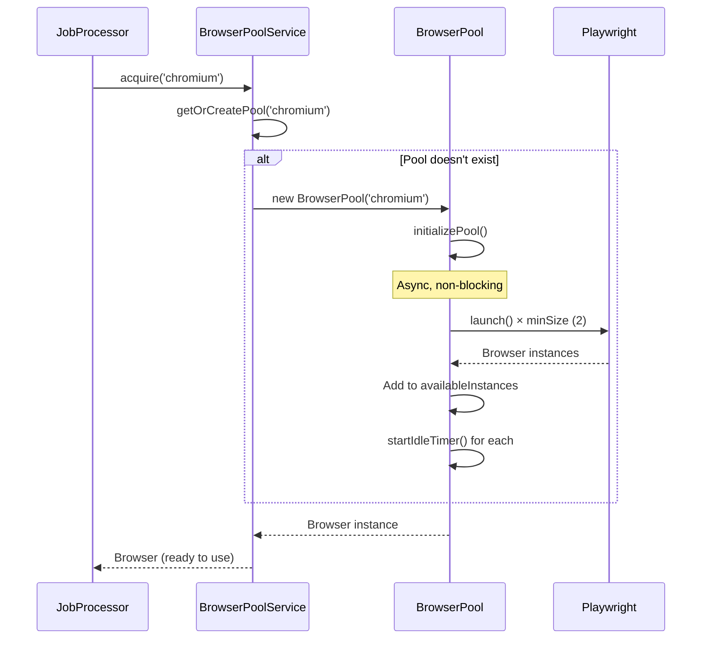
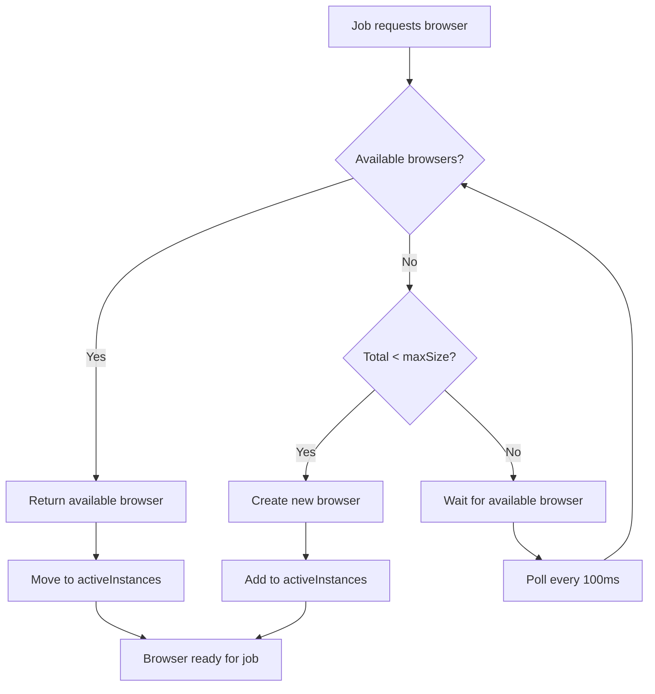
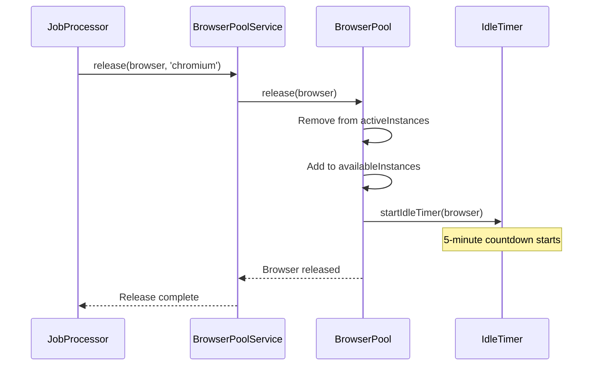
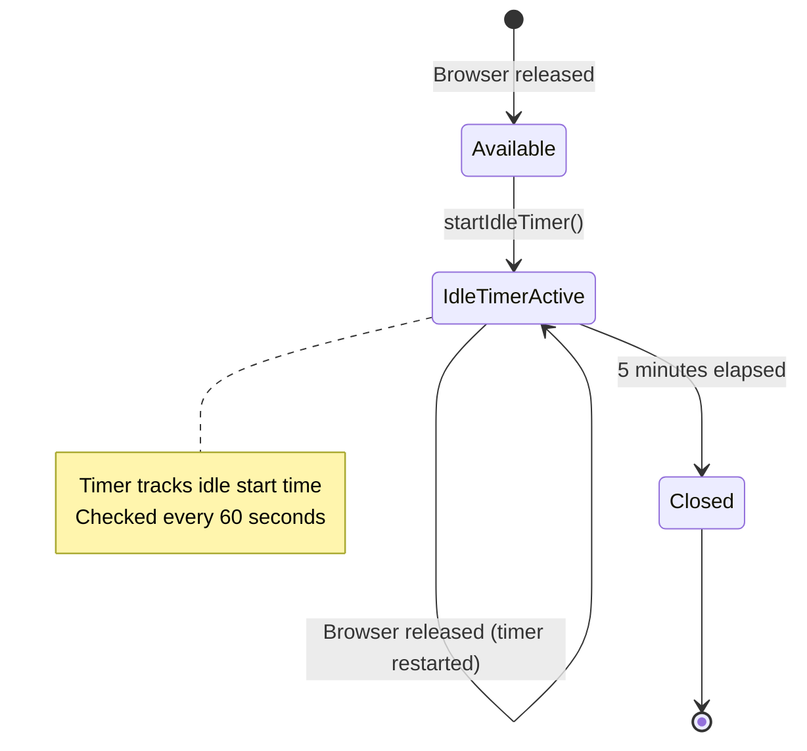
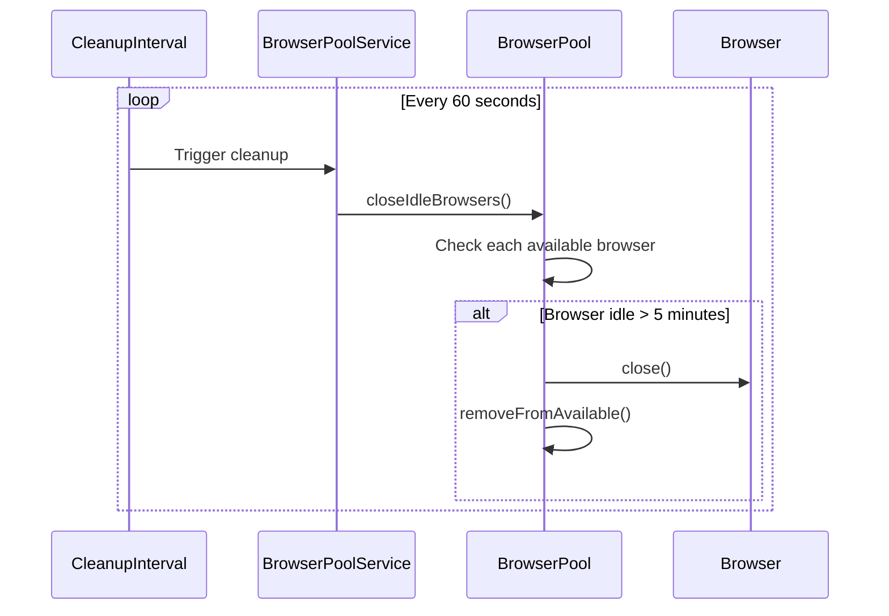
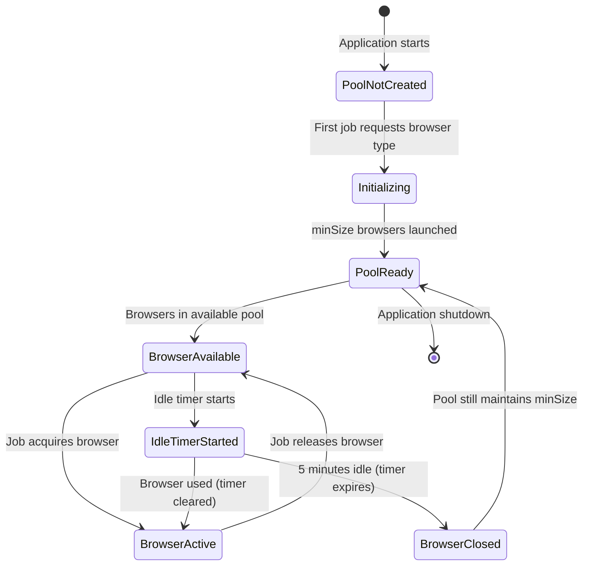
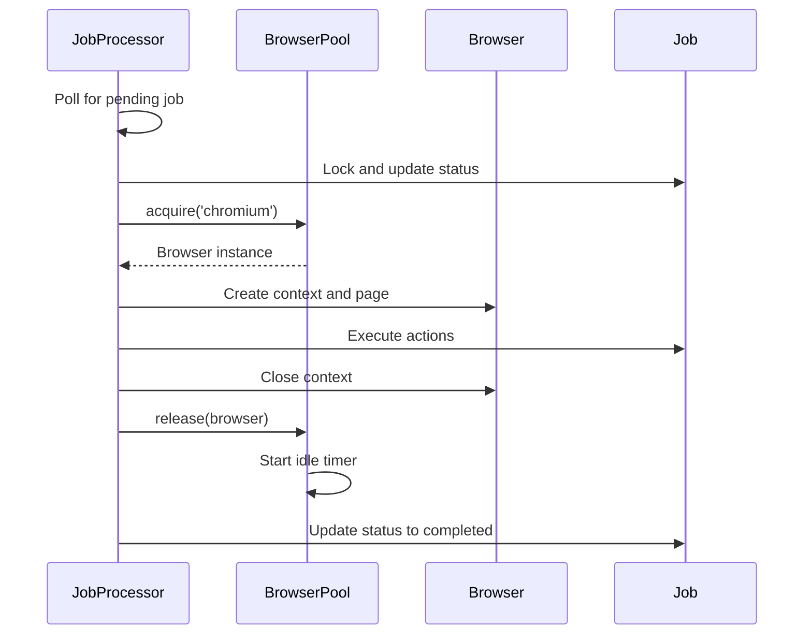

# Browser Launching and Closing Process

This document explains how browsers are launched, managed, and closed in the Browsers API system.

## Overview

The system uses a **lazy initialization** approach where browser pools are created on-demand when the first job requests a specific browser type. This approach balances resource efficiency with performance by:

- Avoiding unnecessary resource consumption for unused browser types
- Launching browsers asynchronously to avoid blocking application startup
- Maintaining a pool of ready browsers for immediate job processing
- Automatically cleaning up idle browsers to free resources

## Architecture

### Pool Structure

```
BrowserPoolService (Singleton)
  │
  ├─► BrowserPool (per browser type: chromium, firefox, webkit)
  │   │
  │   ├─► availableInstances: Browser[] (idle browsers ready for use)
  │   ├─► activeInstances: Set<Browser> (browsers currently processing jobs)
  │   └─► idleTimers: Map<Browser, Timer> (5-minute idle timeout per browser)
  │
  └─► cleanupInterval: Timer (runs every 60 seconds)
```

### Configuration

Default pool configuration:

- **minSize**: 2 browsers (minimum pool size)
- **maxSize**: 10 browsers (maximum pool size)
- **idleTimeout**: 300,000ms (5 minutes - time before idle browsers are closed)
- **cleanupInterval**: 60,000ms (1 minute - how often to check for idle browsers)

## Browser Launching Process

### 1. Lazy Initialization Flow

Browsers are **not** launched at application startup. Instead, pools are created when the first job requests a specific browser type.



### 2. Pool Creation Details

When a pool is first created:

1. **Pool Instantiation**: `BrowserPool` constructor is called with browser type configuration
2. **Async Initialization**: `initializePool()` is called, which triggers `initializePoolAsync()` asynchronously
3. **Parallel Browser Launch**: `minSize` browsers are launched in parallel using `Promise.all()`
4. **Pool Population**: All launched browsers are added to `availableInstances`
5. **Idle Timer Setup**: Each browser gets an idle timer started

**Key Code Flow:**

```typescript
// 1. First acquire() call triggers pool creation
async acquire(browserType: string): Promise<Browser> {
  const pool = this.getOrCreatePool(browserType);  // Creates pool if needed
  return pool.acquire();
}

// 2. Pool creation
private getOrCreatePool(browserType: string): BrowserPool {
  let pool = this.pools.get(browserType);
  if (!pool) {
    pool = new BrowserPool(browserType, config, this.config, this.logger);
    this.pools.set(browserType, pool);
  }
  return pool;
}

// 3. Pool constructor triggers async initialization
constructor(...) {
  this.initializePool();  // Non-blocking async call
}

// 4. Async initialization launches browsers
private async initializePoolAsync(): Promise<void> {
  const minSize = this.config.minSize || 1;  // Default: 2
  const browserPromises = Array.from({ length: minSize }, () =>
    this.createBrowser()
  );
  const browsers = await Promise.all(browserPromises);
  browsers.forEach((browser) => {
    this.availableInstances.push(browser);
    this.startIdleTimer(browser);
  });
}
```

### 3. Browser Acquisition Flow

When a job needs a browser, the pool follows this priority:



**Acquisition Logic:**

1. **Check Available Pool**: If `availableInstances.length > 0`, return immediately
2. **Create if Under Max**: If total instances < `maxSize`, create a new browser
3. **Wait if at Max**: If at `maxSize`, poll every 100ms until a browser becomes available

## Browser Release Process

### 1. Release Flow

After a job completes, the browser is released back to the pool:



### 2. Release Details

**Release Steps:**

1. **Validation**: Verify browser is in `activeInstances`
2. **Connection Check**: Ensure browser is still connected
3. **Move to Available**: Remove from `activeInstances`, add to `availableInstances`
4. **Start Idle Timer**: Begin 5-minute countdown for automatic cleanup

**Code Flow:**

```typescript
async release(browser: Browser): Promise<void> {
  // Remove from active set
  this.activeInstances.delete(browser);
  
  // Verify browser is still connected
  if (!browser.isConnected()) {
    return;  // Skip if disconnected
  }
  
  // Add back to available pool
  this.availableInstances.push(browser);
  
  // Start idle timer (5 minutes)
  this.startIdleTimer(browser);
}
```

## Browser Closing Process

### 1. Idle Timeout Mechanism

Browsers are automatically closed after being idle for 5 minutes:



### 2. Idle Timer Implementation

Each browser gets an idle timer when released:

```typescript
private startIdleTimer(browser: Browser): void {
  this.clearIdleTimer(browser);  // Clear any existing timer
  
  const timer = setTimeout(async () => {
    await this.closeBrowser(browser);
    this.removeFromAvailable(browser);
  }, this.config.idleTimeout);  // 5 minutes (300,000ms)
  
  // Track when timer started for periodic checks
  (timer as any)._idleStart = Date.now();
  this.idleTimers.set(browser, timer);
}
```

**Timer Behavior:**

- **Started**: When browser is released to available pool
- **Cleared**: When browser is acquired for a job
- **Restarted**: When browser is released again
- **Expires**: After 5 minutes of continuous idle time

### 3. Periodic Cleanup

A background process runs every 60 seconds to check for idle browsers:



**Cleanup Logic:**

```typescript
closeIdleBrowsers(): void {
  const now = Date.now();
  let closedCount = 0;
  
  for (const browser of this.availableInstances) {
    const timer = this.idleTimers.get(browser);
    if (timer) {
      const idleStartTime = (timer as any)._idleStart || now;
      const idleDuration = now - idleStartTime;
      
      if (idleDuration > this.config.idleTimeout) {
        this.closeBrowser(browser);
        this.removeFromAvailable(browser);
        closedCount++;
      }
    }
  }
  
  if (closedCount > 0) {
    this.logger.log(`Closed ${closedCount} idle browsers`);
  }
}
```

### 4. Pool Size Management

The pool maintains a dynamic size between `minSize` and `maxSize`:

- **Minimum**: Pool tries to keep at least `minSize` browsers available
- **Maximum**: Pool will not exceed `maxSize` browsers total
- **Idle Cleanup**: Browsers above `minSize` can be closed after idle timeout
- **On-Demand Growth**: New browsers are created up to `maxSize` when needed

**Size Behavior:**

```
Pool State Examples:

Initial (lazy):          0 browsers (pool not created yet)
After first job:         2 browsers (minSize launched)
Under load:              10 browsers (maxSize reached)
After load:              2-10 browsers (idle ones close after 5 min)
```

## Complete Lifecycle Diagram



## Integration with Job Processing

### Job Processing Flow



**Key Integration Points:**

1. **Acquisition**: `JobProcessorService.acquireBrowser()` → `BrowserPoolService.acquire()`
2. **Usage**: Browser used to create context and execute job actions
3. **Release**: `JobProcessorService.releaseBrowser()` → `BrowserPoolService.release()`
4. **Cleanup**: Automatic via idle timers and periodic cleanup

## Resource Management

### Memory Considerations

- **Per Browser**: ~50-200MB memory per browser instance
- **Pool Size**: 2-10 browsers per type = 100MB-2GB per browser type
- **Multiple Types**: 3 types (chromium, firefox, webkit) = up to 6GB total (at maxSize)

### CPU Considerations

- **Browser Launch**: ~2-5 seconds per browser (parallel launches help)
- **Idle Browsers**: Minimal CPU usage when idle
- **Active Browsers**: CPU usage depends on job complexity

### Cleanup Benefits

- **Automatic Resource Recovery**: Idle browsers are closed after 5 minutes
- **Dynamic Scaling**: Pool grows/shrinks based on demand
- **Efficient Startup**: Only launches browsers for types that are actually used

## Configuration Reference

### Environment Variables

Currently, pool configuration is hardcoded but can be made configurable:

```typescript
// Current defaults in BrowserPoolService
{
  minSize: 2,           // Minimum browsers per pool
  maxSize: 10,          // Maximum browsers per pool
  idleTimeout: 300000,  // 5 minutes in milliseconds
}
```

### Future Configuration Options

Potential environment variables:

- `BROWSER_POOL_MIN_SIZE`: Minimum pool size (default: 2)
- `BROWSER_POOL_MAX_SIZE`: Maximum pool size (default: 10)
- `BROWSER_POOL_IDLE_TIMEOUT`: Idle timeout in ms (default: 300000)
- `BROWSER_POOL_CLEANUP_INTERVAL`: Cleanup check interval in ms (default: 60000)

## Troubleshooting

### Common Issues

**Issue**: First job is slow
- **Cause**: Browser pool is being initialized (lazy loading)
- **Solution**: Expected behavior. Subsequent jobs will be faster.

**Issue**: Browsers closing unexpectedly
- **Cause**: Idle timeout (5 minutes) expired
- **Solution**: Normal behavior. Browsers will be recreated on next job.

**Issue**: High memory usage
- **Cause**: Multiple browser types at maxSize
- **Solution**: Reduce `maxSize` or `idleTimeout` to close browsers faster.

**Issue**: Jobs waiting for browsers
- **Cause**: All browsers are active and pool is at maxSize
- **Solution**: Increase `maxSize` or optimize job processing speed.

## Summary

The browser launching and closing process uses a **lazy initialization** strategy that:

✅ **Launches browsers on-demand** when first needed  
✅ **Maintains a pool** of 2-10 browsers per type  
✅ **Automatically closes idle browsers** after 5 minutes  
✅ **Scales dynamically** based on job demand  
✅ **Minimizes resource usage** for unused browser types  

This approach provides an optimal balance between performance and resource efficiency for the Browsers API system.

