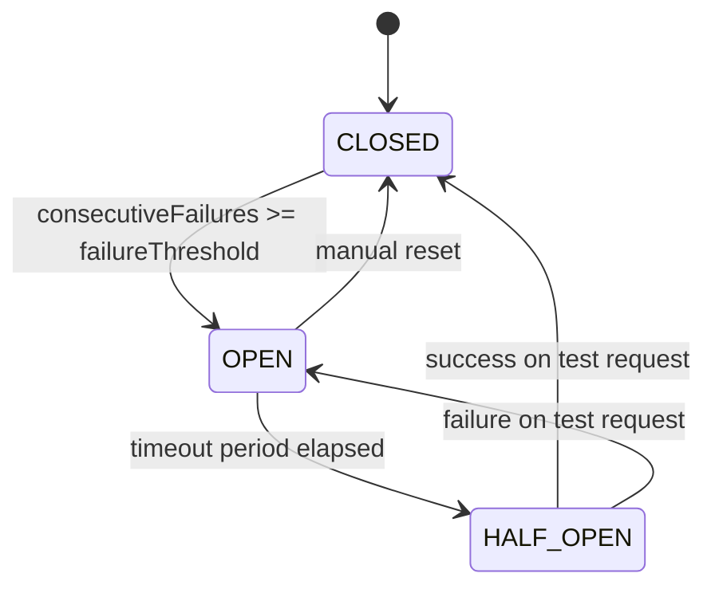

# ADR-001: Circuit Breaker Pattern for Solver Availability

## Status

Accepted

## Date

2024

## Context

The captcha-solver module manages multiple solver types (native browser-automation solvers and third-party API providers). Each solver can fail for various reasons:

- **Transient failures**: Network timeouts, temporary API outages, rate limiting.
- **Persistent failures**: Revoked API keys, depleted balance, service shutdown, configuration errors.
- **Cascading failures**: When a failing solver is retried repeatedly, it wastes time and resources, delays fallback to healthy solvers, and can cause upstream request timeouts.

Without a circuit breaker, the system would continue routing requests to a solver that is consistently failing, resulting in:

1. **Increased latency** -- Every request waits for the failing solver to timeout before trying the next one.
2. **Resource waste** -- Browser pages and network connections are held open unnecessarily.
3. **Degraded user experience** -- End-to-end solve times become unpredictable and slow.
4. **No automatic recovery** -- A solver that recovers after a temporary outage would not be retried unless manually re-enabled.

We needed a mechanism that would:
- Automatically stop sending requests to failing solvers after a threshold.
- Periodically test whether the solver has recovered.
- Resume normal traffic once recovery is confirmed.

## Decision

We implemented `SolverCircuitBreakerService` using the standard three-state circuit breaker pattern:

### States

- **CLOSED** -- Normal operation. All requests are forwarded to the solver. Each failure increments a consecutive failure counter. When the counter reaches the configurable `failureThreshold`, the circuit transitions to OPEN.

- **OPEN** -- The solver is considered unavailable. All requests are immediately rejected without contacting the solver. A `nextAttemptTime` is calculated as `now + timeoutPeriod`. When the current time exceeds `nextAttemptTime`, the circuit transitions to HALF_OPEN.

- **HALF_OPEN** -- A single test request is allowed through. If it succeeds, the circuit transitions to CLOSED and the failure counter is reset. If it fails, the circuit transitions back to OPEN with a new timeout period.

### Per-Solver State

Each solver type maintains its own independent circuit breaker state, stored in a `Map<string, SolverState>`. This ensures that a failure in one solver (e.g., `turnstile-native`) does not affect the availability of another (e.g., `recaptcha-native`).

### Integration Points

1. **SolverRegistry.getAvailableSolvers()** -- Filters out solvers whose circuit breaker is OPEN.
2. **SolverFactory.trySingleSolver()** -- Calls `circuitBreaker.recordSuccess()` or `circuitBreaker.recordFailure()` after each attempt.
3. **SolverFactory.solveWithFallback()** -- Skips solvers where `circuitBreaker.isAvailable()` returns false during the sequential fallback phase.
4. **CaptchaMetricsService** -- Records `captcha_circuit_breaker_trips_total` counter when a circuit transitions to OPEN.

### Configuration

The `failureThreshold` and `timeoutPeriod` are loaded from `CaptchaSolverConfigService.getCircuitBreakerConfig()`, which reads from environment variables with sensible defaults.

### Manual Override

An explicit `reset(solverType)` method is provided for administrative recovery, allowing operators to force a circuit back to CLOSED state.

## Consequences

### Positive

- **Prevents cascading failures** -- Failing solvers are quickly removed from the candidate pool, allowing the system to fall back to healthy alternatives without delay.
- **Automatic recovery** -- The HALF_OPEN state periodically tests whether a solver has recovered, re-enabling it without manual intervention.
- **Reduced latency** -- Requests are not wasted waiting for a solver that is known to be failing.
- **Observability** -- Circuit state transitions are logged and exposed via Prometheus metrics (`captcha_circuit_breaker_trips_total`). The `SolverRegistry.getCircuitBreakerStates()` method provides a full state dump for health check endpoints.
- **Per-solver granularity** -- A failure in one solver type does not affect others.

### Negative

- **Brief unavailability after recovery** -- When a solver recovers, there is a delay (up to `timeoutPeriod`) before the HALF_OPEN state allows a test request. During this window, the solver is not used even though it may be healthy.
- **Configuration tuning** -- The `failureThreshold` and `timeoutPeriod` need to be tuned for different solver types. A threshold too low causes flapping; too high delays circuit opening.
- **Memory overhead** -- Each solver type maintains an in-memory state object, though this is negligible (a few dozen bytes per solver).

### Risks

- If all solvers for a given challenge type are circuit-broken simultaneously, no solving is possible until at least one circuit transitions to HALF_OPEN. This is mitigated by the `SolverFactory.solveWithFallback()` method, which throws a descriptive `SolverUnavailableException` with details about which solvers are circuit-broken and their states.
