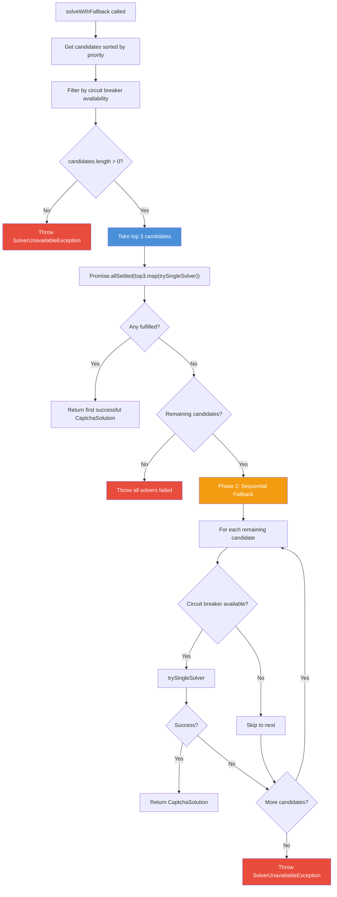

# ADR-002: Parallel Solver Strategy with Sequential Fallback

## Status

Accepted

## Date

2024

## Context

Captcha solving is inherently time-sensitive. Anti-bot challenges expire after a short window, and users expect quick resolution. The captcha-solver module registers multiple solvers per challenge type (e.g., `turnstile-native`, `recaptcha-native`, and potentially third-party providers for reCAPTCHA). The question was how to coordinate attempts across multiple available solvers.

Three strategies were considered:

1. **Pure sequential** -- Try solver A, if it fails try solver B, then C. Simple but slow; total worst-case latency is the sum of all solver timeouts.
2. **Pure parallel** -- Launch all solvers simultaneously, take the first success. Fastest possible time-to-solution but highest cost and resource usage (all solvers run to completion even after one succeeds).
3. **Hybrid: parallel top-N then sequential fallback** -- Launch the top N candidates in parallel, and if all fail, fall back to trying remaining candidates sequentially.

We chose option 3.

## Decision

The solving strategy implemented in `SolverFactory.solveWithFallback()` uses a two-phase approach:

### Phase 1: Parallel Race (Top 3 Candidates)

1. Candidates are retrieved from `SolverRegistry.getSolversByPriority()`, which sorts by health status (healthy > unknown > unhealthy), then by priority (higher first), then by success rate (higher first).
2. Only candidates where the circuit breaker reports availability are included.
3. Up to 3 candidates are launched in parallel using `Promise.allSettled()`.
4. The first fulfilled (successful) result is returned immediately.

### Phase 2: Sequential Fallback

If all parallel candidates fail and there are remaining candidates (beyond the top 3):
1. Each remaining candidate is tried one at a time.
2. Before each attempt, the circuit breaker is re-checked (it may have changed state during the parallel phase).
3. The first success is returned.
4. If all fail, a `SolverUnavailableException` is thrown with details of all attempted solvers.

### Single-Solver Attempt (`trySingleSolver`)

Each individual attempt:
1. Creates a solver instance via `SolverFactory.createSolver()`.
2. Increments the `captcha_active_solve_attempts` Prometheus gauge.
3. Calls `solver.solve(params)`.
4. On success: records success with circuit breaker, solver registry, performance tracker, and metrics.
5. On failure: records failure with all the same services. If the circuit breaker transitions to OPEN, a metrics counter is incremented.
6. Always decrements the active solves gauge in the `finally` block.

### Correlation ID

Every `solveWithFallback()` call generates a UUID correlation ID that is propagated through all log messages and error contexts, enabling end-to-end tracing of a single solving operation across parallel and sequential phases.

### Candidate Selection Scoring

The `calculateSelectionScore()` method produces a composite score for each candidate:

| Factor | Max Points | Logic |
|---|---|---|
| Health status | 50 | healthy=50, unknown=25, validating=10, unhealthy=0 |
| Priority | 30 | `min(priority * 10, 30)` |
| Success rate | 20 | `successRate * 20` |
| Recent success bonus | 10 | +10 if last success was within 24 hours |

## Consequences

### Positive

- **Faster time-to-solution** -- By racing up to 3 solvers in parallel, the expected solve time approaches the fastest solver's time rather than the slowest.
- **Graceful degradation** -- If the top candidates fail, the sequential fallback ensures all available solvers are tried before giving up.
- **Circuit breaker integration** -- Solvers that are known to be failing are automatically excluded, reducing wasted parallel attempts.
- **Observability** -- Correlation IDs, metrics, and structured logging provide full visibility into which solvers were attempted, in what order, and with what results.
- **Bounded parallelism** -- The hard cap of 3 parallel attempts prevents resource exhaustion in scenarios with many registered solvers.

### Negative

- **Higher cost for parallel attempts** -- When using third-party providers, parallel execution means paying for multiple attempts even though only one result is needed. This is mitigated by the fact that native solvers (which are free) have higher priority and are tried first.
- **Resource usage** -- Parallel browser-automation solvers each hold a Playwright page context. The cap of 3 limits this, but it still uses more resources than pure sequential execution.
- **Complexity** -- The two-phase strategy is more complex than a simple sequential loop, making debugging slightly harder. This is offset by the correlation ID and comprehensive logging.

### Alternatives Considered

- **Pure sequential with early termination**: Simpler but significantly slower. Rejected because captcha challenges are time-sensitive.
- **Pure parallel with cancellation**: Ideal for speed but the Playwright-based native solvers do not support clean mid-execution cancellation. `Promise.allSettled` was chosen over `Promise.race` to ensure all tracking (metrics, circuit breaker) is correctly recorded for every attempt.
- **Configurable parallelism count**: Considered but deferred. The count of 3 was chosen as a reasonable default that balances speed against resource usage.
