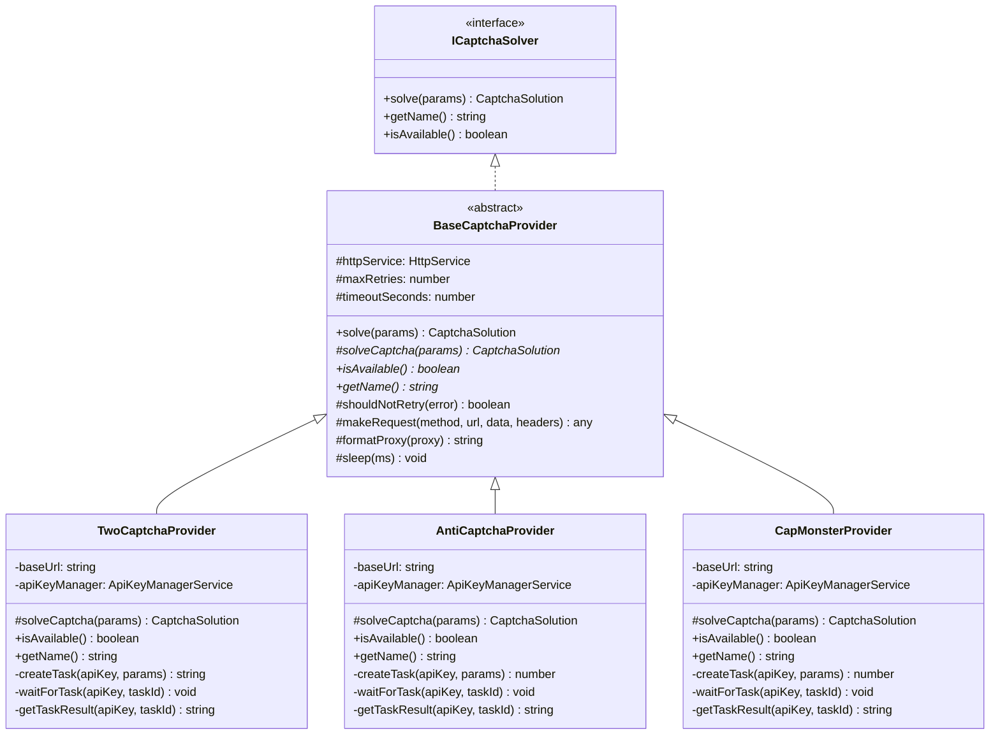

# ADR-003: Provider Abstraction Layer

## Status

Accepted

## Date

2024

## Context

The captcha-solver module needs to support multiple third-party captcha-solving services. At the time of initial design, two services were targeted:
- **2Captcha** (`https://2captcha.com/in.php` / `https://2captcha.com/res.php`)
- **Anti-Captcha** (`https://api.anti-captcha.com/createTask` / `https://api.anti-captcha.com/getTaskResult`)

Each service has a different API format, different endpoint URLs, different error codes, and different task type naming conventions. However, they share the same high-level flow:

1. Submit a captcha task with a site key, URL, and optional proxy.
2. Poll for the task result until it is ready or times out.
3. Extract the solution token from the response.

We anticipated that:
- More providers would be added over time (CapMonster, DeathByCaptcha, etc.).
- Providers may share similar API formats (e.g., CapMonster uses the same API as Anti-Captcha but with a different base URL).
- Common concerns like retry logic, timeout handling, error classification, and proxy formatting should not be duplicated.

## Decision

We introduced a two-level abstraction:

### 1. `ICaptchaSolver` Interface

Defined in `interfaces/captcha-solver.interface.ts`:

```typescript
interface ICaptchaSolver {
  solve(params: CaptchaParams): Promise<CaptchaSolution>;
  getName(): string;
  isAvailable(): Promise<boolean>;
}
```

This is the **contract** that all solvers -- both native and third-party -- must implement. The `ProviderRegistryService` and `SolverFactory` depend only on this interface, enabling polymorphic usage.

### 2. `BaseCaptchaProvider` Abstract Class

Defined in `providers/base-captcha-provider.ts`. Extends `ICaptchaSolver` and provides reusable infrastructure:



**What `BaseCaptchaProvider` handles:**

| Concern | Implementation |
|---|---|
| Retry with backoff | `solve()` wraps `solveCaptcha()` in `retryWithBackoff()` from `utils/retry.util.ts` |
| Timeout | `makeRequest()` uses `AbortController` with configurable `timeoutSeconds` |
| Error classification | Distinguishes `NetworkException` (5xx, ECONNREFUSED, timeout) from `ProviderException` (4xx, API errors) |
| Smart retry decisions | `shouldNotRetry()` prevents retrying on 401, 403, insufficient balance, or invalid parameter errors |
| Proxy formatting | `formatProxy()` converts `ProxyConfig` to URL string format |
| HTTP communication | `makeRequest()` uses `@nestjs/axios` `HttpService` with `firstValueFrom()` |

**What each concrete provider implements:**

- `solveCaptcha(params)` -- The provider-specific task submission, polling, and result extraction logic.
- `getName()` -- Returns the provider identifier (e.g., `"2captcha"`, `"anticaptcha"`, `"capmonster"`).
- `isAvailable()` -- Checks API key availability via `ApiKeyManagerService.isProviderAvailable()`.

### Provider Registration

The `ProviderRegistryService` instantiates all providers on module init and registers them by name:

```typescript
// In ProviderRegistryService.onModuleInit()
const twoCaptcha = new TwoCaptchaProvider(httpService, configService, apiKeyManager, captchaConfig);
this.registerProvider('2captcha', twoCaptcha);

const antiCaptcha = new AntiCaptchaProvider(httpService, configService, apiKeyManager, captchaConfig);
this.registerProvider('anticaptcha', antiCaptcha);

const capMonster = new CapMonsterProvider(httpService, configService, apiKeyManager, captchaConfig);
this.registerProvider('capmonster', capMonster);
```

Each registration is wrapped in a try-catch so that a failure to initialize one provider does not prevent others from being registered.

### Adding a New Provider

The process for adding a new provider (demonstrated by CapMonster) is:

1. **Create a new class** extending `BaseCaptchaProvider` (e.g., `capmonster.provider.ts`).
2. **Implement** `solveCaptcha()`, `getName()`, and `isAvailable()`.
3. **Register** in `ProviderRegistryService.onModuleInit()`.
4. **Add the provider name** to `ApiKeyManagerService`'s provider list for key loading.
5. **Export** from the providers index if needed.

CapMonster was added by largely cloning `AntiCaptchaProvider` because CapMonster uses the same API format (createTask / getTaskResult with `clientKey`) but with `https://api.capmonster.cloud` as the base URL. The only changes were the base URL, provider name, and minor task type adjustments.

## Consequences

### Positive

- **Easy provider addition** -- Adding CapMonster required creating a single file with the provider-specific logic. All retry, timeout, error handling, and proxy formatting were inherited from `BaseCaptchaProvider`.
- **Consistent error handling** -- All providers produce the same exception types (`ProviderException`, `NetworkException`), making upstream error handling uniform.
- **Polymorphic usage** -- `ProviderRegistryService`, `CaptchaSolverService.solveWithFallback()`, and `SolverOrchestrationService` all work with `ICaptchaSolver` without knowing the concrete provider type.
- **Testability** -- The interface makes it straightforward to create mock implementations for unit testing.
- **Shared configuration** -- `maxRetries` and `timeoutSeconds` are loaded from `CaptchaSolverConfigService` once in `BaseCaptchaProvider` and shared by all providers.

### Negative

- **Deep inheritance** -- The concrete providers inherit from `BaseCaptchaProvider`, which can make debugging the retry and error-handling flow less obvious than a flat composition. This is mitigated by the base class being relatively small and well-documented.
- **Constructor coupling** -- Each provider receives `HttpService`, `ConfigService`, `ApiKeyManagerService`, and `CaptchaSolverConfigService` as constructor parameters. This is manageable with 4 dependencies but could grow if providers need more shared services.
- **API format assumptions** -- `BaseCaptchaProvider.makeRequest()` assumes JSON request/response. Providers with non-JSON APIs (e.g., 2Captcha's legacy URL-parameter-based API) need to override or bypass `makeRequest()`.

### Alternatives Considered

- **Composition over inheritance**: Instead of a base class, each provider could compose a shared `HttpClient` helper and `RetryService`. This would reduce coupling but require more boilerplate in each provider. We chose inheritance for the conciseness it provides given the small number of providers.
- **Plugin-based dynamic loading**: Providers could be loaded dynamically from a directory (similar to how `AudioCaptchaProcessingService` lazy-loads speech-to-text providers). This was considered overkill for 3 providers but may be revisited if the number grows significantly.
