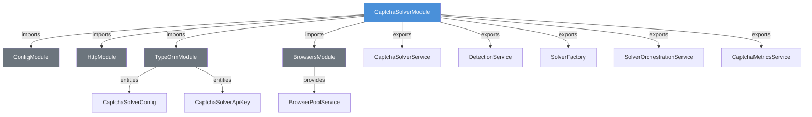
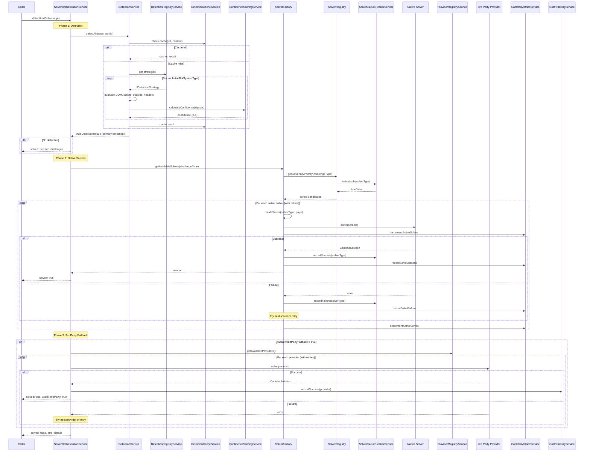

# Captcha Solver Module -- Architecture Documentation

## Overview

The `captcha-solver` module is a NestJS module responsible for detecting anti-bot systems on web pages and solving captcha challenges. It supports both **native browser-automation solvers** (built-in) and **third-party API-based providers** (2Captcha, AntiCaptcha, CapMonster). The module is designed around extensibility, resilience, and observability.

Supported anti-bot systems:
- Google reCAPTCHA (v2, v3)
- hCaptcha
- Cloudflare Turnstile
- DataDome
- Akamai Bot Manager
- Imperva / Incapsula (detection only)

---

## Module Dependencies

The following diagram shows how `CaptchaSolverModule` relates to other NestJS modules:



**ConfigModule** -- Provides environment variable access for all service configuration (provider API keys, timeouts, retry counts, feature flags).

**HttpModule** (`@nestjs/axios`) -- Used by third-party provider implementations (`BaseCaptchaProvider.makeRequest`) to communicate with external captcha-solving APIs.

**TypeOrmModule** -- Persists two entities:
- `CaptchaSolverConfig` -- key-value configuration that can be changed at runtime via the API.
- `CaptchaSolverApiKey` -- stores provider API keys with health metadata (status, failure counts, last use timestamps).

**BrowsersModule** -- Provides `BrowserPoolService`, which supplies Playwright `Page` instances for native browser-automation solvers.

---

## Component Descriptions

### CaptchaSolverService
The main orchestrator and configuration manager. On startup (`onModuleInit`), it loads configuration from environment variables and the database, validates it with a Joi schema, and ensures at least one provider is available. It exposes `solveWithFallback()` for sequential provider-based solving (preferred provider first, then others), delegates API key operations to `ApiKeyManagerService`, cost queries to `CostTrackingService`, and configuration CRUD to the TypeORM repository. Includes an in-memory config cache with a 60-second TTL.

### SolverFactory
Located in `factories/solver-factory.service.ts`. Responsible for creating solver instances and executing the two-phase solving strategy. Uses a **strategy map** (`solverStrategies`) to inject the correct services when constructing native solvers (e.g., `CaptchaWidgetInteractionService` for Turnstile). Key methods:
- `selectBestSolver(challengeType)` -- scores candidates by health, priority, success rate, and recent performance.
- `solveInParallel(params, solverTypes)` -- races multiple solvers using `Promise.allSettled`, returns the first success.
- `solveWithFallback(params)` -- Phase 1: parallel top-3 candidates; Phase 2: sequential fallback through remaining candidates.

### SolverRegistry
Central registry that holds `SolverMetadata` entries (constructor, capabilities, health status, usage counters). Filters solvers by challenge type and circuit breaker availability. Sorts candidates by health status, priority, and success rate via `getSolversByPriority()`.

### SolverOrchestrationService
High-level orchestrator that ties detection and solving together in a single `detectAndSolve(page)` call:
1. Runs `DetectionService.detectAll()` to identify the anti-bot system.
2. Maps the detected system type to a challenge type.
3. Tries native solvers first (with per-solver retries and exponential backoff).
4. Falls back to third-party providers if `enableThirdPartyFallback` is true.
5. Logs all results via `CaptchaLoggingService`.

### ProviderRegistryService
Manages third-party captcha-solving providers. On init, it instantiates and registers `TwoCaptchaProvider`, `AntiCaptchaProvider`, and `CapMonsterProvider`. Provides `getAvailableProviders()` which checks each provider's API key health before returning it.

### DetectionService
Detects anti-bot systems on a Playwright `Page` by analyzing DOM elements, scripts, cookies, and HTTP headers. On init, it registers built-in detection strategies (Cloudflare, DataDome, Akamai, Imperva, reCAPTCHA, hCaptcha) via `DetectionServiceAdapter` objects. Each strategy produces `DetectionSignal` items with a `SignalStrength` (STRONG, MODERATE, WEAK), which are fed to `ConfidenceScoringService` for a 0-1 confidence score. Results are cached by `DetectionCacheService`.

### DetectionRegistryService
Implements the **Registry pattern** for detection strategies. Maps `AntiBotSystemType` to `IDetectionStrategy` instances. Allows external code to register custom detection strategies at runtime without modifying the core service.

### ApiKeyManagerService
Manages API keys with rotation and health tracking. Loads keys from both environment variables and the database. Implements round-robin selection with health-aware sorting (HEALTHY > UNKNOWN > UNHEALTHY). Tracks consecutive failures and automatically marks keys as unhealthy after 3 consecutive failures. Validates all keys on startup via `ApiKeyValidationService`.

### SolverCircuitBreakerService
Implements the **circuit breaker pattern** with three states: CLOSED (normal), OPEN (blocking), and HALF_OPEN (testing recovery). Each solver type has its own circuit breaker state. Configuration (failure threshold, timeout period) comes from `CaptchaSolverConfigService`. See [ADR-001](adrs/001-circuit-breaker-pattern.md) for details.

### CostTrackingService
Tracks per-provider, per-challenge-type costs in memory (up to 1000 recent entries). Uses a predefined cost table (e.g., 2Captcha reCAPTCHA = $0.002/solve). Provides aggregated statistics (total cost, usage by provider, usage by challenge type, cost for time period).

### CaptchaMetricsService
Exposes Prometheus metrics using `prom-client`:
- `captcha_solve_attempts_total` (Counter) -- labeled by provider, captcha_type, status.
- `captcha_solve_duration_seconds` (Histogram) -- labeled by provider, captcha_type.
- `captcha_active_solve_attempts` (Gauge) -- current in-flight solves per provider.
- `captcha_circuit_breaker_trips_total` (Counter) -- circuit breaker transitions to OPEN.
- `captcha_provider_available` (Gauge) -- provider availability (1/0).

### AudioCaptchaProcessingService
Handles audio captcha challenges for reCAPTCHA and hCaptcha audio modes. Downloads audio from page or URL, detects format (MP3/WAV/OGG via magic bytes), and transcribes using speech-to-text providers. **Providers are lazy-loaded** -- only imported when their API key is configured, reducing startup time. Supports Google Cloud Speech, OpenAI Whisper, and Azure Speech. Includes an in-memory transcription cache (SHA-256 keyed), rate limiting per provider, and a request queue.

### NativeSolverRegistryService
Registers the five built-in native solvers with the `SolverRegistry` on module init:
- `TurnstileSolver` -- Cloudflare Turnstile (managed, non-interactive, invisible modes)
- `NativeRecaptchaSolver` -- reCAPTCHA v2/v3 (checkbox, invisible, audio, image)
- `NativeHcaptchaSolver` -- hCaptcha (checkbox, invisible, audio, accessibility)
- `NativeDataDomeSolver` -- DataDome (sensor validation, captcha, slider, cookie)
- `NativeAkamaiSolver` -- Akamai Bot Manager (levels 1-3)

All native solvers have priority 100 (higher than external providers), use browser automation, and have their success rates updated at runtime by `SolverPerformanceTracker`.

---

## Solver Flow

The following sequence diagram shows the end-to-end flow when `SolverOrchestrationService.detectAndSolve()` is called:



---

## Data Flow

The following diagram shows the data flow from an API request through the system:

```mermaid
graph TB
    subgraph "API Layer"
        REQ[HTTP Request]
        CTRL[CaptchaSolverController]
        GUARD[SsrfProtectionGuard]
        THROTTLE[ThrottlerGuard]
    end

    subgraph "Service Layer"
        CSS[CaptchaSolverService]
        ORC[SolverOrchestrationService]
    end

    subgraph "Detection Layer"
        DET[DetectionService]
        DREG[DetectionRegistryService]
        DCACHE[DetectionCacheService]
        CSCORE[ConfidenceScoringService]
        STRAT_CF[Cloudflare Strategy]
        STRAT_DD[DataDome Strategy]
        STRAT_AK[Akamai Strategy]
        STRAT_IMP[Imperva Strategy]
        STRAT_RC[reCAPTCHA Strategy]
        STRAT_HC[hCaptcha Strategy]
    end

    subgraph "Solver Layer"
        SF[SolverFactory]
        SREG[SolverRegistry]
        SPERFT[SolverPerformanceTracker]
        SHEALTH[SolverHealthChecker]
    end

    subgraph "Circuit Breaker"
        CB[SolverCircuitBreakerService]
        CB_CLOSED[CLOSED]
        CB_OPEN[OPEN]
        CB_HALF[HALF_OPEN]
    end

    subgraph "Native Solvers"
        NSREG[NativeSolverRegistryService]
        TURNSTILE[TurnstileSolver]
        NRECAPTCHA[NativeRecaptchaSolver]
        NHCAPTCHA[NativeHcaptchaSolver]
        NDATADOME[NativeDataDomeSolver]
        NAKAMAI[NativeAkamaiSolver]
    end

    subgraph "Third-Party Providers"
        PREG[ProviderRegistryService]
        TWOCAP[TwoCaptchaProvider]
        ANTICAP[AntiCaptchaProvider]
        CAPMON[CapMonsterProvider]
        BASE[BaseCaptchaProvider]
    end

    subgraph "Support Services"
        AKM[ApiKeyManagerService]
        AKV[ApiKeyValidationService]
        COST[CostTrackingService]
        METRICS[CaptchaMetricsService]
        AUDIO[AudioCaptchaProcessingService]
        WIDGET[CaptchaWidgetInteractionService]
        LOGGING[CaptchaLoggingService]
        CONFIG[CaptchaSolverConfigService]
    end

    subgraph "Data Stores"
        DB_CONFIG[(CaptchaSolverConfig)]
        DB_KEYS[(CaptchaSolverApiKey)]
        PROM[(Prometheus)]
    end

    REQ --> THROTTLE --> GUARD --> CTRL
    CTRL --> CSS
    CTRL --> PREG

    CSS --> AKM
    CSS --> PREG
    CSS --> COST

    ORC --> DET
    ORC --> SF
    ORC --> PREG
    ORC --> COST
    ORC --> LOGGING

    DET --> DREG
    DET --> DCACHE
    DET --> CSCORE
    DREG --> STRAT_CF
    DREG --> STRAT_DD
    DREG --> STRAT_AK
    DREG --> STRAT_IMP
    DREG --> STRAT_RC
    DREG --> STRAT_HC

    SF --> SREG
    SF --> SPERFT
    SF --> CB
    SF --> METRICS
    SREG --> CB

    CB --> CB_CLOSED
    CB --> CB_OPEN
    CB --> CB_HALF

    NSREG --> SREG
    NSREG -.->|registers| TURNSTILE
    NSREG -.->|registers| NRECAPTCHA
    NSREG -.->|registers| NHCAPTCHA
    NSREG -.->|registers| NDATADOME
    NSREG -.->|registers| NAKAMAI

    PREG --> TWOCAP
    PREG --> ANTICAP
    PREG --> CAPMON
    TWOCAP --> BASE
    ANTICAP --> BASE
    CAPMON --> BASE

    BASE --> AKM

    AKM --> AKV
    AKM --> DB_KEYS
    CSS --> DB_CONFIG
    METRICS --> PROM

    NRECAPTCHA -.-> AUDIO
    NHCAPTCHA -.-> AUDIO
    TURNSTILE -.-> WIDGET
    NRECAPTCHA -.-> WIDGET

    style SF fill:#4a90d9,color:#fff
    style ORC fill:#4a90d9,color:#fff
    style CB fill:#e74c3c,color:#fff
    style DET fill:#27ae60,color:#fff
    style PREG fill:#f39c12,color:#fff
    style NSREG fill:#8e44ad,color:#fff
```



---

## Provider Abstraction

All third-party providers implement the `ICaptchaSolver` interface:

```typescript
interface ICaptchaSolver {
  solve(params: CaptchaParams): Promise<CaptchaSolution>;
  getName(): string;
  isAvailable(): Promise<boolean>;
}
```

Concrete providers extend `BaseCaptchaProvider`, which provides:
- Retry with exponential backoff (`retryWithBackoff`)
- HTTP request handling with timeout and abort support
- Smart retry decisions (no retry on 401/403, insufficient balance, or invalid params)
- Proxy formatting
- Error wrapping into `ProviderException` / `NetworkException`

See [ADR-003](adrs/003-provider-abstraction.md) for the design rationale.

---

## Key Design Patterns

| Pattern | Where | Purpose |
|---|---|---|
| Circuit Breaker | `SolverCircuitBreakerService` | Prevent cascading failures from broken solvers |
| Registry | `SolverRegistry`, `DetectionRegistryService`, `ProviderRegistryService` | Decoupled registration and lookup of strategies/solvers/providers |
| Strategy | `IDetectionStrategy`, `SolverCreationStrategy` | Pluggable detection and solver creation logic |
| Factory | `SolverFactory` | Centralized solver instantiation with dependency injection |
| Template Method | `BaseCaptchaProvider` | Common solve flow with abstract `solveCaptcha()` hook |
| Adapter | `DetectionServiceAdapter` | Wraps detection methods into the `IDetectionStrategy` interface |
| Lazy Loading | `AudioCaptchaProcessingService` | Speech-to-text providers loaded only when API keys are configured |
| Race-to-Success | `SolverFactory.solveInParallel` | Parallel execution with first-success-wins semantics |

---

## Configuration Sources

Configuration is loaded from two sources with database values taking precedence:

1. **Environment variables** -- `CAPTCHA_SOLVER_PREFERRED_PROVIDER`, `CAPTCHA_SOLVER_TIMEOUT_SECONDS`, `CAPTCHA_SOLVER_MAX_RETRIES`, etc.
2. **Database** (`captcha_solver_config` table) -- Runtime-configurable via `PATCH /captcha-solver/config`.

The `CaptchaSolverConfigService` centralizes access to typed configuration sections (detection, retry, timeout, circuit breaker, provider, solver timeout).

---

## API Endpoints

| Method | Path | Description |
|---|---|---|
| `GET` | `/captcha-solver/providers` | List all providers with availability status |
| `POST` | `/captcha-solver/test` | Test solve a captcha (SSRF-protected, rate-limited) |
| `GET` | `/captcha-solver/config` | Get current configuration |
| `PATCH` | `/captcha-solver/config` | Update a configuration key-value pair |
| `GET` | `/captcha-solver/stats` | Get usage statistics and total cost |
